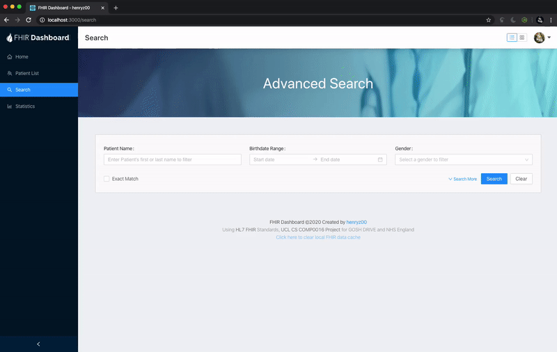
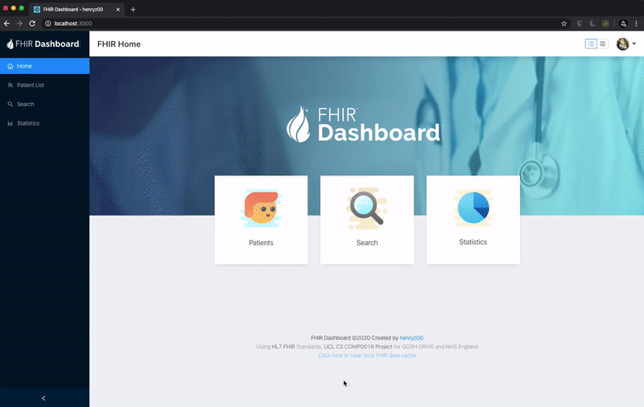

# FHIR Responsive React Dashboard

## About

This project is built for COMP0016 FHIRworks Hackathon (FHIRworks open source packages for GOSH DRIVE and NHS England). The app provides an easy to use, responsive web and mobile dashboard interfaces for users to view, search and analyse FHIR datasets.

[Run the app on github pages](https://henryz00.github.io/GOSH-FHIRworks2020-React-Dashboard/) (Dynamic data won't load, local demo data will be used)

This web app is built using:

- [React.js](https://reactjs.org/) + [React Router](https://reacttraining.com/react-router/)
- [Ant Design](https://ant.design/)
- [HL7 FHIR Standard](https://www.hl7.org/fhir/)
- [Chart.js React](https://github.com/jerairrest/react-chartjs-2)

The theme of the project is `6. Responsive design app form pulling data from a series of FHIR records e.g. retrieving and flattening the data, from a front-end design`, however, it is also combined with `2. Graphing data` and `10. Searching`.

## Screenshots

### Overview
The dashboard prototype came with three main sections (Patient list viewer, Advanced Search, Statistics), utilising FHIR data strcuture and standards. The web app is fully responsive, with a separate mobile tab menu for native mobile app experience.

### FHIR Data Viewer (With Raw Json viewer)
The patient list can be viewed by a choice of table or card layout. In the table layout, the user can easily sort the entire database by clicking the table head, and view full patient observation in a popup drawer. 

For each observation entry, more advanced user can even view the raw FHIR json for more detailed info.

### Search
Due to the extensiveness of FHIR data structure, each search rule has to be carefully written, thus it is quite difficult to write an advanced search function with these many data inputs. However, with the help of the antd library, quite promising results can still be acheived.

### Statistics
Although this is not required in project (No.6) description, I would love to learn and utilizing chart.js with React to visiualize dataset like FHIR. A filter and restructure function has been written to manipulate the raw FHIR data and making it easier to be analyzied in the app.

### Responsive Design
The web app is fully responsive, down to every smaller detail. This is quite hard, as the ant design library doesn't came with responsive design. In addition, I have chosen a separate menu component for mobile and desktop (bottom tabbar and side menu), which will be enabled and disabled programmatically. By doing this, it will also make the process to migrate the app to a React native app much easier, which can be installed on native smart phone and tablets.

### Other Details

## Available Scripts

In the project directory, you can run:

### `yarn start`

Runs the app in the development mode. 
Open [http://localhost:3000](http://localhost:3000) to view it in the browser.

The page will reload if you make edits. 
You will also see any lint errors in the console.

### `yarn build`

Builds the app for production to the `build` folder. 
It correctly bundles React in production mode and optimizes the build for the best performance.

The build is minified and the filenames include the hashes. 
Your app is ready to be deployed!

See the section about [deployment](https://facebook.github.io/create-react-app/docs/deployment) for more information.

